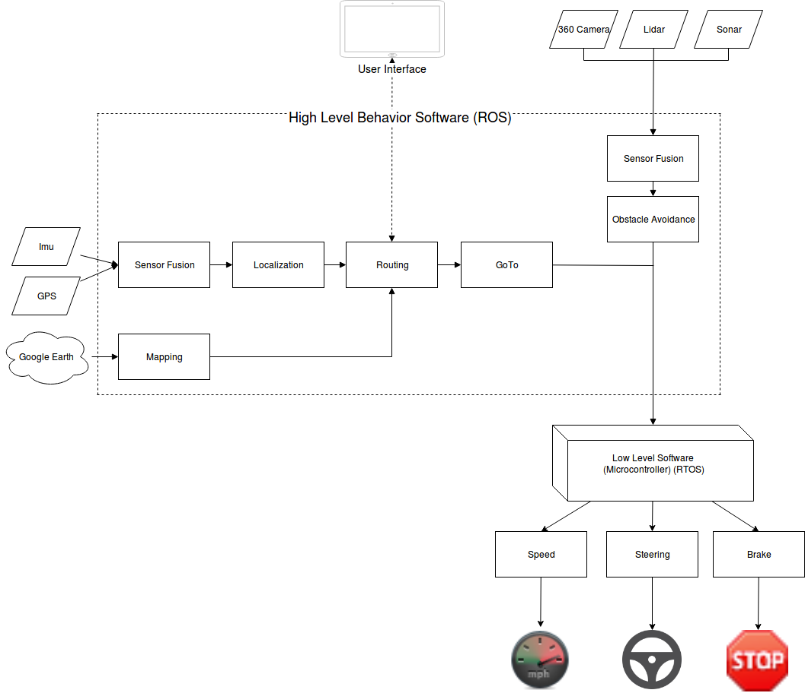

# CPP Self Driving Husky

Review Status: Not Reviewed

## Introduction

Cal Poly Pomona's research lab wants to showcase the hard work and projects of their engineering students. One of those
projects is a self-driving golf cart. As a stepping stone towards that goal and proof of concept, Husky A200 will be
used to simulate autonomous self-driving. The goal is to have our autonomous vehicle to be driving on campus to showcase
to our current and future students.

## User Stories

* As a user, I want to be able to tell Husky to go from point A to point B.

* As a user, I want Husky to be able to avoid moving obstacles.

* As a user, I want Husky to be able to avoid static obstacles.

* As a user, I want to be able to know where Husky is.

* As a user, I want to be able to control Husky's movement at any given time.

## Requirements

**The requirements below are referenced from [System Requirements Document.](docs/CPP-Driverless-Vehicle-SRS.docx)**

* The behavior software system shall perform autonomous control the steering.

* The behavior software system shall perform autonomous vehicle to stopping (braking).

* The behavior software system shall perform autonomous vehicle attitude / direction control.

* The behavior software system shall provide support for full steering control to the user as required by operation mode.

* The behavior software system shall provide interface between the user full braking control to the user as required by operation mode.

* The behavior software system shall provide full acceleration control to the user as required by operation mode.

* The behavior software system shall provide data fusion from all sensors that capture vehicle internal state awareness.

* The behavior software shall receive internal sensor data for autonomous processing

* The behavior software shall perform sensor fusion from all sensors that capture vehicle situational sensor data for autonomous processing.

*  The behavior software shall provide real-time support with a deterministic response time of tbd ms (RTOS)

*  The behavior software system shall interface to the user interface for processing.

*  The behavior software system shall provide an open transport layer protocol structure.

*  The behavior software system shall implement the route/reroute planning.

*  The behavior software system shall implement the points of interest (POI) way-points into the route planning.

*  The behavior software system shall implement the modes of operation.

*  The behavior software system shall issue emergency behavior for sudden stops.

*  The behavior software system shall be simulated prior to deployment using near similar target processing with the development environment.

*  The behavior software system shall maintain its location along the route calculated.

*  The behavior software system shall calculate the acceleration and deceleration command data to the embedded system.

## Common Terminologies

* Autonomous - vehicle that is capable of sensing its environment and navigating without human input.

* Self Driving - vehicle that is capable of sensing its environment and navigating without human input.

* Husky A200 - medium sized robotic development platform.

* Obstacle - Any object obstructing Husky's path.

* ROS - Robot Operating System. The underlying operating system that all programs execute on Husky.

## Background

It is assumed that readers of this document are comfortable with Husky A200 and ROS.

Husky is a medium sized robotic development platform. Stereo cameras, LIDAR, GPS, IMUs, manipulators and more can be added to Husky.
Husky uses an open source serial protocol and we offer API support for ROS, and options for C++ and Python.

ROS is not an actual operating system. It is middleware that abstracts away the interfacing between hardware and software. However it is still important to understand the difference between ROS and RTOS.

For more details please check out the [onboarding documentation.](https://github.com/cpp-self-driving-husky/cpp-husky-a200-docs)

## Solution

Currently, the Husky A200 comes equipped with Ubuntu 14.04 and ROS installed. This will also be replicated on the golf cart. However, based on the requirements there is a need for real time support. This will be done by using an RTOS along with Orocos.

Most likely most of the behavior that handles communicating to the actual golf cart will be abstracted away within micro-controllers.

Below are the components that will comprise of the self-driving Husky A200.

* Localization - Component that is responsible for keeping track of Husky's location within an unknown environment.

* [Mapping](https://github.com/cpp-self-driving-husky/cpp-husky-a200-mapping) - Component that is responsible for constructing or updating a map of an unknown environment.

* [Sensor Fusion](https://github.com/cpp-self-driving-husky/cpp-husky-a200-sensor-fusion)

* [Stereo Vision](https://github.com/cpp-self-driving-husky/cpp-husky-a200-stereo-vision)

* Communication Interface - Component that will abstract away implementation details of every sensor
 on Husky.

* Mission Control - Middle man that will allow for communicating and receiving instructions to
and from Husky remotely.

* [Obstacle Avoidance](https://github.com/cpp-self-driving-husky/cpp-husky-a200-avoidance) - Component that is responsible for determining if an object is obstructing Husky's way and rerouting Husky's direction and action.

* Routing/Rerouting - Responsible for planning the most optimal route towards the goal.

### Architecture

## Cost

## Timeline

### Milestones

1. Husky goes from point A to point B under preferable weather conditions.

2. Husky goes from point A to point B, while avoiding static objects in its way preferable weather conditions.

3. Husky goes from point A to point B, while avoiding moving obstacles preferable weather conditions.

### Stretch Goals

1. Husky is able to move from point A to point B at night time.

2. Husky is able to move from point A to point B under harsh weather conditions.

### Out of Scope

1. Husky is able to traverse all types of terrain (stairs, mud, water).

2. Husky is able to recover from damage.

## Launch Plan

## Success Criteria

1. Husky is able to move from Point A to Point B without any human intervention or aid.

2. Husky is able to successfully avoid static and moving objects and get to its point B without human intervention or aid.

## Risks

1. New technology - There is a high chance that many of the students working on this project are new to ROS and Husky.
In addition self driving vehicles is a concept that is still being researched and as time goes on a lot more things may
be discovered. In addition, a lot of unforeseen problems can occur in relation to the hardware and software.

2. Not full time - We are students that aren't able to dedicate 40 hours / week for this project. Students will also have
other obligations such as classes, jobs and etc. It is also expected that getting everyone up to speed on the topic and
development process will cause a lot of time to be invested early on. It is expected that progress will be slow in the
beginning.

3. Husky - This may possibly not be a risk, however we are limited to Husky and ROS for accomplishing our goal. There is
a risk that it might not be possible or extremely difficult to implement a self driving car. It is difficult to say
whether Husky or ROS will be a bottleneck.

## Open Questions

Q1. Would it be possible to add additional sensors?

Q2. How does Husky handle situations in which internet connections are lost?

Q3.  How does Husky operate during the night time?

Q4. Why was Husky chosen as the self driving platform?

Q5. Why was ROS chosen as the operating system?

    A5. ROS already comes pre-installed with Husky A200. In addition, the company behind Husky has chosen to use ROS.

## Reference

1. [Husky A200](https://www.clearpathrobotics.com/husky-unmanned-ground-vehicle-robot/)
2. [ROS](http://www.ros.org/)
3. [Autonomous Car](https://en.wikipedia.org/wiki/Autonomous_car)
4. [Mapping](https://ocw.mit.edu/courses/aeronautics-and-astronautics/16-412j-cognitive-robotics-spring-2005/projects/1aslam_blas_repo.pdf)
5. [Why ROS is not real time?](http://answers.ros.org/question/134551/why-is-ros-not-real-time/)
6. [Real-time control in ROS and ROS 2.0](https://www.osrfoundation.org/wordpress2/wp-content/uploads/2015/11/ROSCon15-Kay.pdf)
7. [Golf cart prototype using ROS and Gazebo](https://www.matec-conferences.org/articles/matecconf/pdf/2016/38/matecconf_icmie2016_09005.pdf)
8. [Cal Poly Slo's Golf Cart using ROS](http://users.csc.calpoly.edu/~clupo/teaching/Capstone/pastwork/avid_whitepaper.pdf)
9. [ROS 2](https://github.com/ros2/ros2/wiki)
10. [Open Source RTOS](https://www.osrtos.com/)
11. [Set-up for real-time control with ROS](http://answers.ros.org/question/61162/set-up-for-real-time-control-in-ros/)
